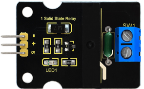
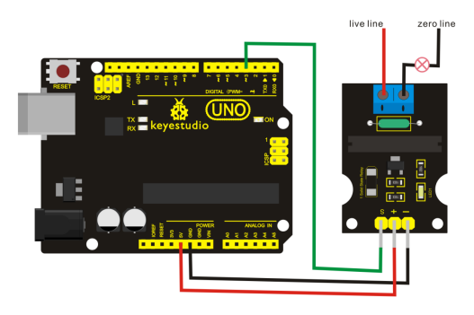

# KS0263 keyestudio Single Solid State Relay Module



## 1. Introduction

Keyestudio single solid state relay is **active at LOW** level, that is to say, the input control signal is the low level (0-1.5 V), the relay is on; while the input control signal is high level (3-5 V), the relay is off.

Solid State Relay is a new kind of contactless switching device, which is composed of all solid state electronic components.

Compared with the electromagnetic relay, it has higher reliability, with the features of non-contact, long service life, fast speed and less outside interference.

The output control terminal of keyestudio solid-state relay must be connected to the circuit, **can only be AC (Alternating Current)** , so that the solid state relay can be disconnected normally.

## 2. Performance Parameters

- Electrical parameters:

| Voltage | Static Current | Working Current | Trigger Voltage | Trigger Current |
| :-----: | :------------: | :-------------: | :-------------: | :-------------: |
|  DC 5V  |      0mA       |     12.5mA      |     0-1.5V      |       2mA       |

- Output port： AC 100V/2A

## 3. Connection Diagram



## 4. Sample Code

Download code :  [Code](./Code.7z)

```c
int Relay = 3;

void setup()
{
   pinMode(Relay, OUTPUT);     //Set Pin3 as output
}

void loop()
{
   digitalWrite(Relay, HIGH);   //Turn off relay
   delay(1000);
   digitalWrite(Relay, LOW);    //Turn on relay
   delay(1000);
}
```

## 5. Result

Wiring as the above image, after powered-on, the solid state relay breaks for 1S and then connects for 1S, repeating alternately.